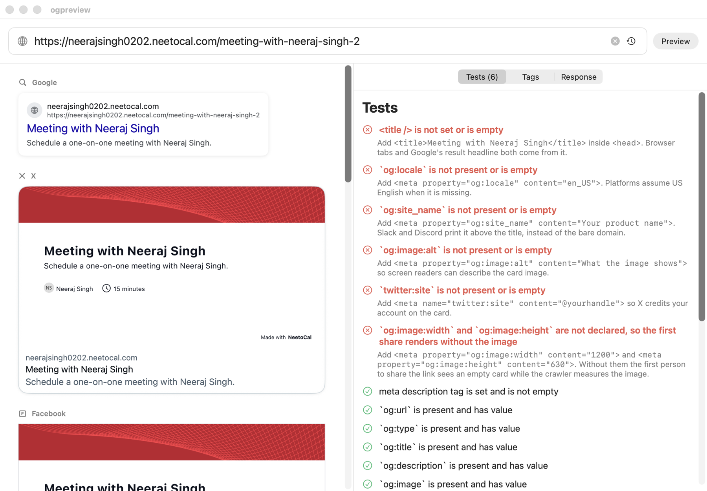

# ogpreview

ogpreview is a Mac app that shows how a link will unfurl on Google, X, Facebook, LinkedIn, Slack, Discord, iMessage and WhatsApp, and tests the page's Open Graph tags before you share it.

<p align="center">
  <a href="https://github.com/neetozone/ogpreview/releases/latest/download/ogpreview-macos.dmg">
    
  </a>
</p>



## Features

* **Eight real previews** - Google, X, Facebook, LinkedIn, Slack, Discord, iMessage and WhatsApp, each drawn with that platform's own layout, colours and truncation.
* **Sees what crawlers see** - fetches with a crawler user-agent, no cookies and no JavaScript, so the preview matches what Facebook and Slack actually read.
* **27 pass/fail tests** - every tag platforms use, their lengths against what each platform truncates, and the `og:image`'s real dimensions, aspect ratio and weight.
* **Tells you how to fix it** - each failing test carries the exact tag to paste, filled in with the page's own values.
* **Shows the passes too** - failures list first, confirmed-good checks below, so you can see what was verified.
* **Tag and response inspectors** - every Open Graph, Twitter, standard and link tag, plus status, redirect chain, content type, size and timing.
* **Automatic updates** - checks the latest GitHub release with Sparkle and installs signed updates.
* **Universal** - one build runs natively on Apple Silicon and Intel Macs.

## Installation instructions

1. Download [ogpreview-macos.dmg](https://github.com/neetozone/ogpreview/releases/latest/download/ogpreview-macos.dmg), open the DMG, and drag `ogpreview.app` to Applications.
2. Open `ogpreview.app`. The build is ad-hoc signed, so the first launch needs right-click > **Open** > **Open** to get past Gatekeeper.
3. Paste a URL and press **Preview**.

The app checks for updates daily. You can also use **ogpreview > Check for Updates...** from the macOS menu bar.

### Build from source

Needs the Xcode Command Line Tools; there is no Xcode project.

```bash
git clone https://github.com/neetozone/ogpreview.git
cd ogpreview

# Run from source
swift run

# Open straight onto a page
swift run ogpreview https://example.com

# Build a double-clickable macOS app bundle
scripts/make-app.sh
open ogpreview.app

# Build the release DMG
scripts/make-dmg.sh

# Regenerate the icon from Resources/icon.png
scripts/make-icon.sh
```

Released builds are universal (arm64 + x86_64). SwiftPM's `--arch` needs full Xcode, so on a machine with only the Command Line Tools the scripts build for that machine's architecture and say so; CI has Xcode, so the DMG on every release is universal.

`OGPREVIEW_PLATFORMS=slack,discord` narrows the preview column to a few cards. When it is set, the address bar shows a "Filtered" badge, so a shortened list can never be mistaken for missing previews.

## Signing key

Updates are only installable if they are signed with the one key installed copies
trust. Each build carries a public key in its `Info.plist`; Sparkle rejects any
update signed by a different key, and reports that to users as nothing at all —
updates simply stop arriving.

The key lives in two places, and **neither survives a new laptop by itself**:

* the macOS login keychain, on the account `neetozone` (this is the only readable copy)
* the `SPARKLE_ED_PRIVATE_KEY` repository secret, which GitHub will never show back

A fresh Mac has no key, and `generate_keys` quietly makes a *new* one. Ship with
that and every existing install stops updating. So keep a backup outside both:

```bash
# Back the key up — paste into a password manager, then clear the clipboard
.build/artifacts/sparkle/Sparkle/bin/generate_keys --account neetozone -x /tmp/ogpreview-sparkle.key
pbcopy < /tmp/ogpreview-sparkle.key && rm -P /tmp/ogpreview-sparkle.key

# On a new Mac, import the backup — never generate a fresh key
.build/artifacts/sparkle/Sparkle/bin/generate_keys --account neetozone -f ogpreview-sparkle.key

# Check at any time that the local key still matches what the app trusts
scripts/make-app.sh && scripts/verify-signing-key.sh
```

Every release verifies this automatically: the workflow derives the public key
from the secret and compares it against the built app, and fails the release
rather than publishing an update nobody can install.

If the key is ever lost from both places, it cannot be recovered. The only way
forward is to publish a build carrying a new public key and have everyone install
it by hand once — auto-update cannot cross that gap.

## Cutting a release

Sparkle updates are published from GitHub Releases.

To publish an update:

1. Create and publish a GitHub release tag such as `v0.3`.
2. The `Release macOS app` workflow builds a universal `ogpreview-macos.dmg`.
3. The workflow signs the update archive, generates `appcast.xml`, and uploads both files to the release.
4. Installed copies of ogpreview see the new appcast and offer the update.

## How it works

One fetch feeds both halves of the window:

```text
crawler-agent fetch  -->  meta tags  -->  8 platform cards   (left)
                                     \->  27 tests + fixes   (right)
                          og:image    ->  downloaded and measured
```

1. **Fetch** - `MetadataFetcher` requests the page as `facebookexternalhit`, recording the redirect chain, status, timing and byte count.
2. **Parse** - `HTMLMetaParser` pulls `<title>`, every `<meta>` and the `<link rel>` tags out of the served markup. No JavaScript runs, because no crawler runs it either.
3. **Probe** - the `og:image` is downloaded and measured, so its real dimensions, aspect ratio and weight can be tested rather than trusted.
4. **Render** - each platform's card resolves its own fallback chain (X reads `twitter:*` then `og:*`, Google reads `<title>` then `og:title`), so the previews differ exactly where the real ones do.

## Tech Stack

<p>
  <a href="https://www.swift.org/"></a>
  <a href="https://developer.apple.com/xcode/swiftui/"></a>
  <a href="https://developer.apple.com/swift/"></a>
  <a href="https://sparkle-project.org/"></a>
</p>

## Layout

* `Sources/ogpreview/Net/MetadataFetcher.swift` - crawler-agent fetch, redirect chain, image probe.
* `Sources/ogpreview/Net/HTMLMetaParser.swift` - `<title>`, `<meta>` and `<link>` extraction.
* `Sources/ogpreview/Models/Audit.swift` - the test list, and the fix line for each failure.
* `Sources/ogpreview/Models/PageMetadata.swift` - one fetch, plus each platform's fallback chain.
* `Sources/ogpreview/Views/PreviewCards.swift` - the eight platform cards.
* `Sources/ogpreview/Views/InspectorView.swift` - Tests, Tags and Response panels.

## License

MIT — see [LICENSE](LICENSE).
